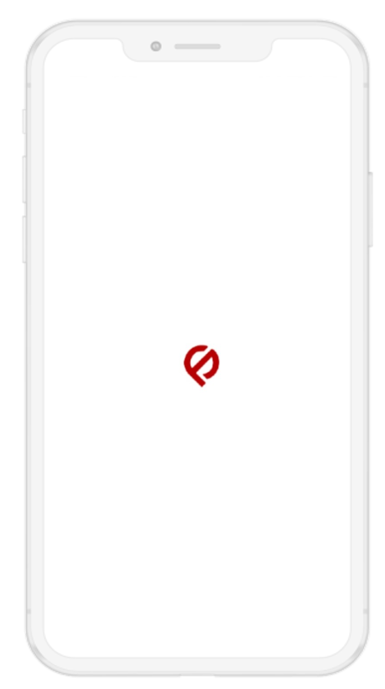
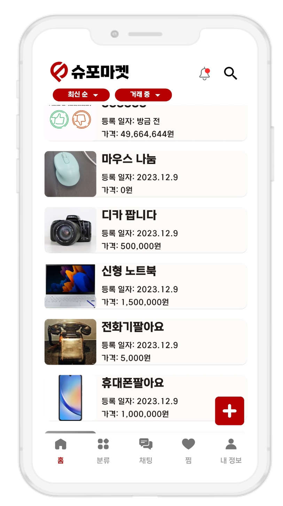
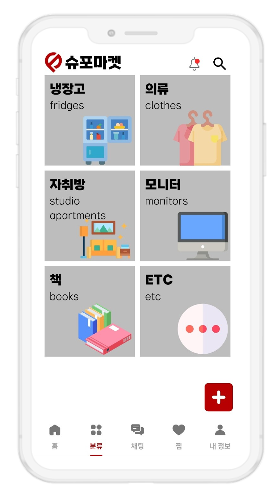

# Supomarket Application

## 📌 Description

A mobile marketplace app designed for on-campus second-hand trading at POSTECH.  
Built during UGRP (Undergraduate Research Program) 2023.
It is backend work of the application

---

## 🛠️ Tech Stack
- **Frontend**: Flutter

---

## ✨ Features
- User sign up / login
- Product listing & image upload
- Chat-based messaging between users - it wasn't my work so my fellow developer has it.
- User history (buying list, like history, selling list, score etc..)

---

## 📸 Screenshots 

  

For other detail screenshots, you can see to click the Store link below
---

## Notice  
But the surver fee issue I stopped the server from 2025.04.01
I already made the snapshot of the website server so if you want to see contact me for my Email

---

 
## Downloawd Link 
Android PlayStore - https://play.google.com/store/apps/details?id=com.supomarket.supo_market

iOS AppStore - https://apps.apple.com/kr/app/supomarket/id6477733742?platform=iphone

---
